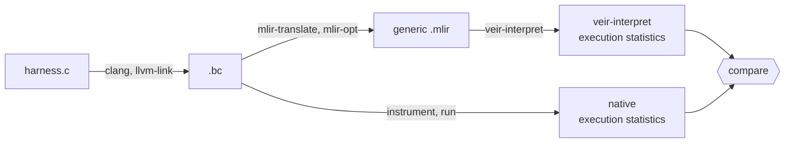

# Veir-Interpreter Scoreboard

Like the [veir-sqlite](https://github.com/opencompl/veir-sqlite) scoreboard, but for `veir-interpret`.
> [!NOTE]
> `veir-interpret` does not yet log execution statistics. The current scoreboard does therefore not show any progress yet.

## Updating the Scoreboard

Updating `SCOREBOARD.md` requires only `uv`, `lake` and a local VeIR checkout used for the scoring.

``` bash
make check-corpus # Optional
VEIR_DIR=veir make scoreboard --jobs <N>
```

We have two kind of test harnesses: `sqlite-harnesses` and `minimal-harnesses`.
The `minimal-harnesses` directory includes some basic test harnesses which test a specific behavior, such that it is easier to make initial progress on the leaderboard.

MLIR files and execution statistics of the LLVM-generated binaries require a full LLVM/MLIR toolchain to generate. They are therefore cached and stored in `corpus.tar.gz`.

## Updating the Corpus

The Nix development shell is derived from VeIR's Nix flake.
The following commands regenerate the corpus with the toolchain provided by upstream VeIR:

```bash
nix flake update
nix develop
get-upstream-veir veir
make refresh-corpus
```

The generated files are not reproducible between toolchains / architectures!
`make refresh-corpus` records the toolchain and flags that produced the corpus, plus a SHA-256 of `corpus.tar.gz`, in `manifest.json`.

# Architecture



Both branches start from the same `.bc`: one produces the generic MLIR that `veir-interpret` executes, the other produces ground-truth execution statistics by actually running the (instrumented) harness natively.  
The scoreboard compares the two and reports how closely `veir-interpret`'s statistics match the native run.
Currently, we only record the function execution counts.
